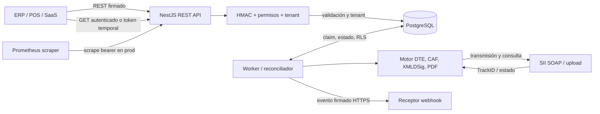

# Arquitectura

## Componentes

| Capa           | Implementación observada                                                                                                                                   |
| -------------- | ---------------------------------------------------------------------------------------------------------------------------------------------------------- |
| Frontend       | No encontrado. API entrega JSON, XML, PDF y Swagger opcional.                                                                                              |
| Backend HTTP   | NestJS/Express en src/main.ts; prefijo global /api/v1; ValidationPipe con whitelist, forbidNonWhitelisted y transform.                                     |
| Aplicación     | Casos de uso de emisión/consulta y servicios de integración; controllers son adaptadores HTTP.                                                             |
| Dominio        | Entidades/contratos de repositorio bajo src/domain. Las reglas aparecen sobre todo en servicios y motor tributario.                                        |
| Datos          | TypeORM/PostgreSQL; trece entidades de aplicación más cron_nonces y tabla de migraciones TypeORM. El módulo Nest habilita synchronize fuera de producción. |
| Cola/jobs      | Tabla integration_requests; reclamo atómico con FOR UPDATE SKIP LOCKED. Worker setInterval; no hay servicio de colas externo.                              |
| SII            | SiiSoapClient usa Fetch, SOAP y multipart; SiiMockSoap para desarrollo/pruebas; XSD por xmllint al habilitar validación.                                   |
| Almacenamiento | XML firmado y metadatos en Postgres; logo en bytea; CAF/firma dentro de tenant_configs.config_json. PDF se genera bajo demanda desde DTE/XML.              |
| Logs/métricas  | Winston a consola, prom-client y endpoint de métricas. Algunas métricas declaradas no son incrementadas desde código de aplicación.                        |

## Diagrama de alto nivel

El diagrama representa relaciones de código; no implica que SII/Prometheus hayan sido alcanzables.

## API y autenticación

Los controladores viven en src/controllers. Rutas B2B usan IntegrationHmacGuard y permisos explícitos. El prefijo API es /api/v1. No hay JWT/Passport en AppModule.

Autenticación de integración: X-Api-Key, X-Timestamp, X-Nonce y X-Signature. Tenant sale de credencial. Rutas administrativas usan el mismo guard con permisos. /artifacts/:token es descarga sin HMAC de API, autorizada por token firmado y vencimiento. Los crons usan secreto HMAC distinto.

Swagger se sirve en /api/docs cuando se habilita o el entorno no es producción. El baseline contiene 27 paths/31 operaciones; el contrato generado declara autenticación, permisos y responses por operación. `npm run openapi:check` valida completitud y drift.

## Base de datos y aislamiento

B2BPostgresDataServices registra credenciales y nonces como lookup global; los otros repositorios son tenant-scoped. PostgresGenericRepository falla cerrado sin tenant y establece app.tenant_id mediante set_config dentro de transacción. RLS se aplica a solicitudes, RCOF, webhooks, DTE, envíos SII, configuración, auditoría y perfiles visuales. Worker usa app.worker_scope=true dentro de operaciones cross-tenant.

Se usa DB_SCHEMA (default public). Algunas migraciones verifican tablas base existentes para coexistir con ERP. La cobertura de una instalación compartida puede variar según historial real; las policies remotas no fueron consultadas.

## Workers, jobs y colas

- IntegrationWorkerService corre si INTEGRATION_WORKER_ENABLED=true, intervalo mínimo 10 s (default 60 s).
- Cada tick procesa cola, consulta estados DTE/RCOF, entrega webhooks y purga nonces de integración; tras la hora configurada intenta RCOF diario. La clave persistida por tenant/fecha/secuencia permite reintentar tras reinicio sin encolar duplicados.
- Reclama queued o processing con lock vencido, lote default 5; SKIP LOCKED reduce doble claim.
- /internal/cron/* es un disparador HMAC manual/respaldo. .github/workflows/cron-jobs.yml solo tiene workflow_dispatch, no programación automática.

## Integraciones y servicios externos

1. **Postgres/Supabase:** persistencia; SSL configurable y obligatorio en producción.
2. **SII:** autenticación semilla/token, transmisión DTE/RCOF y consulta. Modo mock/real; flujo real exige certificado PFX y URL RCOF.
3. **Webhooks de clientes:** POST HTTPS, firma HMAC, redirecciones deshabilitadas y validación/pinning de IP.
4. **Render:** blueprint Docker con servicio web, worker y migraciones pre-deploy.
5. **GitHub Actions:** CI y cron manual de respaldo; no gestiona cola principal.
6. **Prometheus:** scraping de métricas.

No se encontró conexión activa a ERP, pagos, correo, Shopify, WooCommerce, Redis o bucket.

## Infraestructura y despliegue

Dockerfile compila en Node 22, copia dist, incluye dumb-init, libxml2-utils y CA bundle, y corre como usuario node. render.yaml define web y worker en Ohio, con secretos de un grupo compartido; el web ejecuta migraciones antes de tráfico. docker-compose.yml levanta Postgres, migrador, API y worker.

Instancias, secretos cargados y servicios efectivamente desplegados son **desconocidos** sin inspección del proveedor.
