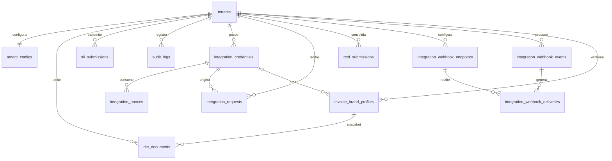

# Modelo de datos

## Fuente y límites

Inventario derivado de entidades TypeORM en src/infrastructure/framework/postgres/entities y migraciones en src/database/migrations. No se consultó una base; el schema real puede tener tablas heredadas del ERP. Columnas lógicas principales:

| Tabla                          | Campos principales                                                                                                                                                                                                                                                                                 | Relaciones, índices y restricciones                                                                                                                                                                     |
| ------------------------------ | -------------------------------------------------------------------------------------------------------------------------------------------------------------------------------------------------------------------------------------------------------------------------------------------------- | ------------------------------------------------------------------------------------------------------------------------------------------------------------------------------------------------------- |
| tenants                        | id, rut, business_name, trial_ends_at, plan_id, GDPR/retención, billing_email, timestamps                                                                                                                                                                                                          | RUT unique; raíz lógica. Sin RLS propia en estas migraciones.                                                                                                                                           |
| tenant_configs                 | id, tenant_id unique, config_json JSONB, timestamps                                                                                                                                                                                                                                                | FK tenant cascade; perfil tributario, CAF/firma y marca activa. RLS.                                                                                                                                    |
| dte_documents                  | id, tenant_id, type, folio, receiver_rut/name, amount numeric(12,2), xml_content, brand_profile_id, signature_value, status, track_id, status_history JSONB, timestamps                                                                                                                            | FK tenant cascade; unique (tenant_id,type,folio); índices tenant/status/created/brand; FK compuesta perfil id+tenant, delete restrict; RLS.                                                             |
| sii_submissions                | id, tenant_id, track_id, status, response_xml, error_message, submission_type, book fields, idempotency_key, timestamps                                                                                                                                                                            | FK tenant cascade; unique tenant/idempotency_key; índices tenant, TrackID y tenant/status; RLS. Incluye columnas libro no expuestas por rutas actuales.                                                 |
| audit_logs                     | id, tenant_id, user_id, action, ip_address, user_agent, payload JSONB, prev_hash/hash/sequence, timestamps                                                                                                                                                                                         | FK tenant restrict; índices tenant, tenant/action/created y user_id; RLS. Cadena hash no observada en servicios actuales.                                                                               |
| integration_credentials        | id, tenant_id, key_id, secret_hash, secret_encrypted JSONB, signing_version, secret_last4, name, type, permissions, status, expiry/usage/rotation/revocation, created_at                                                                                                                           | FK tenant cascade; key_id unique; índice tenant. Lookup global, sin RLS.                                                                                                                                |
| integration_nonces             | id, credential_id, nonce, expires_at, created_at                                                                                                                                                                                                                                                   | FK credential cascade; unique (credential_id,nonce); índice expiry. Lookup global, sin RLS.                                                                                                             |
| integration_requests           | id, tenant_id, kind, idempotency_key, resource_key, request_hash, external_reference, payload/metadata JSONB, state, dte_id/rcof_id, origin_credential_id, attempts/max_attempts, next_attempt_at/locked_at, last_error/state_history/response_snapshot JSONB, submitted/finalized/created/updated | FK tenant cascade y origin credential; unique (tenant,kind,resource,key) tras 180560; unique tenant/external_reference; índices state/next, tenant/state, dte_id. dte_id/rcof_id sin FK declarada. RLS. |
| rcof_submissions               | id, tenant_id, period_date, sequence, xml_content, track_id, status, sii_response JSONB, timestamps                                                                                                                                                                                                | FK tenant cascade; unique (tenant,period,sequence); índice status. RLS.                                                                                                                                 |
| integration_webhook_endpoints  | id, tenant_id, url, secret_cipher, secret_last4, events, active, description, created_at                                                                                                                                                                                                           | FK tenant cascade; índice tenant. RLS.                                                                                                                                                                  |
| integration_webhook_events     | id, tenant_id, type, request_id/rcof_id, payload JSONB, created_at                                                                                                                                                                                                                                 | FK tenant cascade; índices tenant/request_id; referencias request/RCOF sin FK observada. RLS.                                                                                                           |
| integration_webhook_deliveries | id, tenant_id, event_id, endpoint_id, attempt/max_attempts, status, next_attempt_at, response_status/snippet, last_error, delivered_at/created_at                                                                                                                                                  | FK tenant/event/endpoint cascade; índices status/next y event_id. RLS.                                                                                                                                  |
| invoice_brand_profiles         | id, tenant_id, version, logo_data BYTEA, logo_mime_type, logo_sha256, colors, created_by_credential_id, created_at                                                                                                                                                                                 | FK tenant cascade; credential set null; unique tenant/version e id/tenant; checks version/color/logo; trigger inmutable; RLS.                                                                           |
| cron_nonces                    | nonce PK varchar(128), expires_at                                                                                                                                                                                                                                                                  | Tabla operativa anti-replay; índice expiry; sin tenant.                                                                                                                                                 |
| typeorm_migrations             | Gestionada por TypeORM                                                                                                                                                                                                                                                                             | Registro de migraciones aplicadas.                                                                                                                                                                      |

Las entidades suman 13 tablas gestionadas por TypeORM; cron_nonces y typeorm_migrations son infraestructura adicional.

## Diagrama ER

El diagrama muestra relaciones lógicas; request→DTE/RCOF y evento→request/RCOF son referencias de aplicación sin FK observada. La relación DTE→perfil tiene FK compuesta.

## Constraints, enums y migraciones

Estados, tipos de credencial y permisos se guardan en varchar/text/simple-array, no como enum nativo. Constraints importantes: folio, credencial, nonce, idempotencia, externalReference, RCOF y versión de marca; checks y trigger de inmutabilidad de marca.

Migraciones:

1. 1804900000000-CreateStandaloneTaxBase crea tablas base para instalación independiente. En base compartida se presupone que tablas base existen. Su rollback automático se rechaza para evitar borrar tablas preexistentes del ERP.
2. 1805000000000-AddIntegrationsApi agrega credenciales, nonces, requests, RCOF y webhooks.
3. 1805100000000-WorkerRlsPolicy amplía policies para app.worker_scope.
4. 1805200000000-EngineTableRls habilita RLS en tablas del motor; omite tablas ausentes o que ya tenían RLS activa en public.
5. 1805300000000-AddCredentialSecretEncrypted agrega secreto cifrado.
6. 1805400000000-AddCronNonces persiste anti-replay cron.
7. 1805500000000-IntegrationCredentialProtocolV2 versiona firma por credencial.
8. 1805600000000-IntegrationRequestResourceKey cambia unicidad por tipo/recurso.
9. 1805700000000-InvoiceBrandProfiles agrega marca versionada, FK snapshot y RLS.

RLS usa tenant_id::text = current_setting('app.tenant_id', true), con app.worker_scope=true para worker. Credentials/nonces son globales; estado remoto de roles/grants/policies: desconocido.
