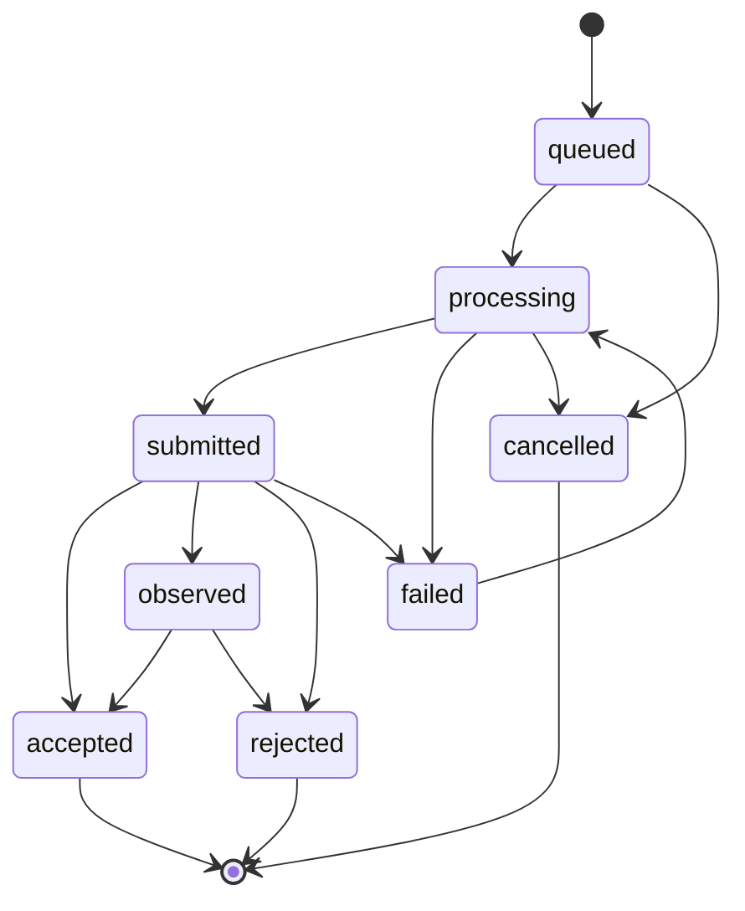

# Modelo de dominio reconstruido

## Nota de modelado

Las clases TypeORM representan almacenamiento. El dominio funcional es una plataforma de emisión tributaria por tenant con una solicitud durable de integración que puede producir DTE o RCOF. No se encontró agregado formal con métodos de negocio dentro de src/domain/entities; invariantes se aplican en servicios de aplicación, motor SII, repositorios y constraints de PostgreSQL.

## Conceptos y relaciones

| Concepto             | Persistencia relacionada                                   | Descripción                                                                                                                     |
| -------------------- | ---------------------------------------------------------- | ------------------------------------------------------------------------------------------------------------------------------- |
| Tenant/contribuyente | tenants, tenant_configs                                    | Empresa identificada por UUID y RUT; perfil tributario, CAF, firma y configuración de emisor.                                   |
| Credencial           | integration_credentials, integration_nonces                | Identidad técnica ligada a tenant, tipo api/admin, permisos, expiración, secreto cifrado y versión de firma.                    |
| Solicitud B2B        | integration_requests                                       | Intención idempotente para DTE, nota o RCOF; mantiene payload, estado, intentos y vínculo opcional a resultado.                 |
| DTE                  | dte_documents                                              | Documento tributario numerado por tipo/tenant, XML firmado, receptor, monto, historial y estado SII.                            |
| Envío SII            | sii_submissions                                            | TrackID/estado de transmisión; sin FK a documento observada.                                                                    |
| RCOF                 | rcof_submissions                                           | Consumo de folios por fecha y secuencia; XML, TrackID y respuesta.                                                              |
| Perfil visual        | invoice_brand_profiles                                     | Versión inmutable de colores/logo fijada por DTE.                                                                               |
| Endpoint webhook     | integration_webhook_endpoints                              | Destino HTTPS, eventos suscritos, secreto cifrado y flag activo.                                                                |
| Evento/entrega       | integration_webhook_events, integration_webhook_deliveries | Evento persistido y entrega por endpoint con reintentos y respuesta.                                                            |
| Auditoría            | audit_logs                                                 | Acción, actor opcional, IP, agente, payload y columnas de hash/secuencia. No se encontró rutina de cadena criptográfica activa. |

Una solicitud puede referenciar dte_id o rcof_id; migraciones no declaran FK para esos campos. DTE se relaciona con perfil de marca mediante FK compuesta que exige mismo tenant. Asociación DTE/envío se reconstruye por track_id, no por FK.

## Agregados inferidos

- **Tenant tributario** (INFERIDO): raíz lógica para configuración, credenciales, documentos, RCOF, perfiles y webhooks. Cada request autenticado toma tenant de credencial; repositorio y RLS aplican aislamiento.
- **Solicitud B2B** (CONFIRMADO): unidad de idempotencia/estado público; contiene request hash, resourceKey, externalReference, payload y resultado asociado.
- **DTE** (CONFIRMADO): folio único por tenant y tipo; XML persiste con el resultado. Snapshot visual es inmutable.
- **RCOF** (CONFIRMADO): único por tenant, fecha y secuencia.
- **Entrega webhook** (CONFIRMADO): intento independiente asociado a evento/endpoint; reintentos persistidos.

## Estados

Estados públicos declarados: queued, processing, submitted, accepted, observed, rejected, failed y cancelled.

accepted, rejected y cancelled son terminales; failed puede volver a processing. Cancelación está en el mapa de estados, pero no se encontró endpoint.

Estados internos DTE se proyectan así: BORRADOR/FIRMADO → processing; ENVIADO → submitted; ACEPTADO → accepted; REPARO → observed; RECHAZADO → rejected; ANULADO → cancelled.

RCOF persiste submitted, accepted, observed, rejected o failed. Entrega webhook usa pending, delivering, delivered, failed o dead. Endpoint usa boolean active.

## Invariantes y restricciones de dominio

- Folio único tenant/tipo; reserva con fila bloqueada y DTE se persiste antes de transmitir.
- RCOF único tenant/fecha/secuencia; consolida boletas 39/41 emitidas en la fecha e incluye anuladas en reporte de consumo.
- Solicitud idempotente distingue tenant, kind, resourceKey y Idempotency-Key; también conserva hash del body.
- Tipo 34/41 requiere todos los ítems exentos; tipo 39 no admite exentos. Tipos 33/34/46/52 requieren receptor; tipo 52 requiere transporte.
- Tipo 46 requiere autorización especial en perfil cuando se emite en modo real.
- Perfil visual crea versiones; brand_profile_id del DTE no puede cambiar después de insertarse.
- Operación tenant-scoped requiere contexto CLS/Postgres. Credencial y nonce se consultan globalmente antes de resolver tenant.
- Estado público cambia mediante máquina explícita; cambios notificables generan evento webhook si el dispatcher está disponible.

## Eventos observables

Se producen dte.submitted, dte.accepted, dte.observed, dte.rejected, dte.failed y variantes rcof.*. No se encontró bus externo.

## Desconocidos

No hay evidencia suficiente sobre proceso legal de onboarding, retención de tenants, quién concede autorización T46, cancelación/reversa, conservación/eliminación de DTE ni atomicidad entre estado y evento webhook.
