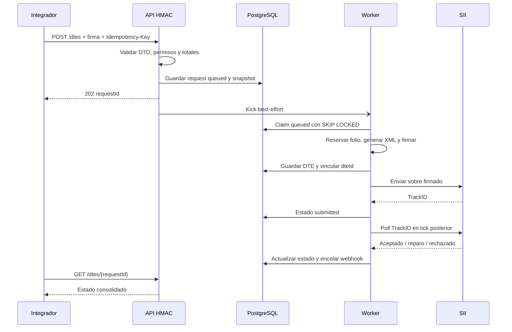

# Flujos de usuario

## 1. Emisión y consulta de DTE

Actor integrador; requiere credential con dte:emit y luego dte:read.

La operación de emisión es asíncrona aunque el controller lance un kick de un request en el mismo proceso HTTP; la fuente persistente sigue siendo PostgreSQL. Las solicitudes `observed` continúan consultándose por el mismo TrackID y nunca retransmiten automáticamente el DTE.

## 2. Nota de crédito/débito

1. Integrador pasa dteId original, key, motivo, líneas y totales opcionales.
2. API verifica tenant y extrae tipo, folio, receptor y fecha desde el documento original.
3. API añade referencia con razón/código, recalcula y persiste solicitud de tipo credit-note (61) o debit-note (56), vinculada al original mediante resourceKey.
4. Worker procesa por el mismo motor DTE.

No existe ruta de anulación directa de DTE. El código permite notas, pero su resultado tributario requiere validar reglas del SII.

## 3. RCOF manual y diario

Manual: cliente firma POST /rcof con fecha y secuencia; la solicitud se encola; worker consolida boletas del día, firma y transmite; cliente usa GET /rcof/{id}.

Diario: worker usa America/Santiago para calcular ayer, recorre tenants, detecta boletas 39/41 no borrador y encola una solicitud persistida de secuencia 1 con clave determinista por fecha. El processor/poller estándar transmite y consulta; tras un reinicio, el worker recupera el trabajo pendiente desde PostgreSQL. El replay diario no crea una segunda solicitud.

## 4. Alta y rotación de credencial

1. Administrador presenta credencial con credentials:write a POST /credentials.
2. API genera keyId y secreto, persiste datos cifrados y devuelve secreto una vez.
3. Integrador firma requests con secreto y nonce único.
4. Admin rota: nueva llave; anterior expira a las 24 horas como máximo. Revocación inmediata; no permite retirar última admin activa.

La ruta asume tenant ya existente; el bootstrap-admin.ts también recibe UUID de tenant preexistente.

## 5. Registro y entrega de webhooks

1. Admin registra URL HTTPS pública y suscripciones a eventos.
2. API devuelve secreto webhooks una vez.
3. Cuando solicitud llega a estado notificable, se persiste evento y una entrega por endpoint suscrito.
4. Worker reclama entregas, firma timestamp+body y hace POST.
5. 2xx queda delivered; otros resultados vuelven a pending con backoff o llegan a dead. Admin puede consultar historial y pedir redelivery.

Los consumidores deben tolerar reordenamiento y deduplicar por event id; guía sugiere polling como fuente de verdad.

## 6. Configuración tributaria y marca

Admin carga CAF y PFX usando endpoints protegidos por HMAC/permisos. El motor descifra material al emitir. Folios se reservan con lock en tenant_configs. Para identidad visual, PUT crea nueva versión completa; cada DTE guarda perfil visual activo y PDF posterior lo reconstruye con la versión histórica.

La secuencia para dar de alta tenant y guardar el perfil tributario no está expuesta por HTTP; el proceso operativo aprobado sigue pendiente en TENANT_PROVISIONING.md.

## 7. Operación

Liveness GET /health no depende de DB. Readiness GET /ready consulta DB, flag de integraciones y master key. Worker corre ticks periódicos al activarse; crons HMAC son disparadores de respaldo. Métricas se scrapean bajo /api/v1/metrics; producción exige token bearer.
